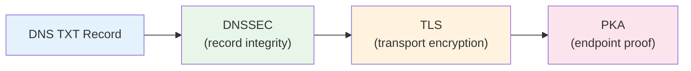

# Security Best Practices

This guide covers the AID security model: what it protects against, how its defense layers work, and practical steps for providers and clients.

## Threat Model Overview

AID is a **discovery and identity bootstrap** protocol. It answers: "Where is this domain's agent, and is it authentic?" Understanding what AID does and does not protect against is essential.

### What AID Protects Against

- **Misdirection:** A client connecting to the wrong endpoint because it has no standard way to look up the right one.
- **Impersonation (with PKA):** A malicious server claiming to be the agent for `example.com`. PKA proves the server holds the private key matching the public key published in DNS.
- **Downgrade attacks:** If a domain previously advertised `pka` and later removes it, compliant clients warn the user.
- **DNS spoofing (with DNSSEC):** DNSSEC ensures the TXT record hasn't been tampered with in transit.

### What AID Does NOT Protect Against

- **Compromised DNS provider:** If an attacker gains control of your DNS zone, they can publish any TXT record. Mitigate with strong DNS provider credentials and MFA.
- **Compromised server:** AID verifies the endpoint matches the published key, not that the server itself is secure.
- **Application-layer attacks:** SQL injection, XSS, and other application-layer vulnerabilities are outside AID's scope. Those are the responsibility of the agent's implementation.
- **Ongoing session security:** AID bootstraps identity; it does not manage sessions or tokens. That is the job of the agent protocol (MCP, A2A, etc.).

## Defense in Depth

AID uses layered security. Each layer adds protection independently.



| Layer           | Protects Against                 | Required?           |
| --------------- | -------------------------------- | ------------------- |
| **DNS TXT**     | Misdirection                     | Yes (core protocol) |
| **DNSSEC**      | Record tampering in transit      | Recommended         |
| **TLS (HTTPS)** | Eavesdropping, MitM on transport | Required for remote |
| **PKA**         | Server impersonation             | Optional            |

**Minimum viable security:** DNS + TLS (every remote endpoint).
**Recommended:** DNS + DNSSEC + TLS + PKA.

## DNSSEC

DNSSEC cryptographically signs DNS records, preventing tampering between the authoritative nameserver and the resolving client.

**For providers:**

- Enable DNSSEC signing on your zone. Most managed DNS providers (Cloudflare, Vercel, Route 53) offer one-click activation.
- Verify signing is active: `dig +dnssec TXT _agent.yourdomain.com` should return `RRSIG` records.

**For clients:**

- Use resolvers that validate DNSSEC (check the AD bit in DNS responses).
- Expose an opt-in flag (e.g., `--require-dnssec`) for security-sensitive contexts.
- When DNSSEC validation fails, return `ERR_SECURITY` rather than silently falling back.

## HTTPS and Redirect Security

All remote agent URIs MUST use `https://` (or `wss://` for WebSocket). Plain HTTP is never acceptable for production.

### Redirect Attacks

An attacker who controls an intermediate network could attempt to redirect HTTPS connections. AID clients should:

- **Block cross-origin redirects** from the discovered URI. If `_agent.example.com` points to `https://api.example.com/mcp`, a redirect to `https://evil.com/mcp` should be rejected.
- **Require explicit user consent** before following any redirect to a different origin.
- **Limit redirect depth** — follow at most 1-2 redirects to prevent redirect chains.

### TLS Best Practices

- Verify the TLS certificate matches the host in the discovered URI.
- Use TLS 1.2 or later. Prefer TLS 1.3.
- Do not disable certificate validation, even in development (use `localhost` exceptions instead).

## Local Execution Safeguards (`proto=local`)

Local execution (`proto=local`) runs code on the client's machine. This is the highest-risk protocol token and requires strong safeguards.

### Required Client Behavior

1. **Explicit consent before first run:** Display the full command that will be executed. Never auto-execute on first discovery.

   ```
   Agent "Dev Tools" at dev.example.com wants to run:
     docker run myorg/agent:latest
   Allow? [y/N]
   ```

2. **Fingerprint and re-prompt on change:** Store a hash of `uri + proto`. If either changes on re-discovery, treat it as a new agent and prompt again.

   ```
   ⚠ Agent at dev.example.com changed its command:
     Old: docker run myorg/agent:v1
     New: docker run myorg/agent:v2
   Allow updated command? [y/N]
   ```

3. **Use argument arrays, not shell strings:** Never pass the URI through a shell interpreter. Use `execve`-style argument arrays to prevent command injection.

   ```javascript
   // GOOD
   spawn('docker', ['run', 'myorg/agent:latest']);

   // BAD — vulnerable to injection
   exec(`docker run ${uri}`);
   ```

4. **Sandbox when possible:** Use container restrictions, seccomp profiles, or VM isolation for local agents.

5. **No nested discovery:** A local agent should not trigger further AID discovery without explicit user consent.

## IDN Safety

Internationalized Domain Names (IDNs) can be used for homoglyph attacks (e.g., `exаmple.com` using Cyrillic `а`).

**For providers:** Use ASCII-only domains when possible. If using IDN, ensure the A-label (Punycode) form is unambiguous.

**For clients:** Warn users when a domain contains mixed scripts or known confusable characters. Display both the Unicode and Punycode forms in security prompts.

## PKA Key Management

Public Key Attestation adds cryptographic endpoint proof. Proper key management is essential.

### Best Practices

- **Generate keys securely:** Use a cryptographically secure random number generator for Ed25519 key pairs. The `aid-doctor keygen` command does this correctly.
- **Protect the private key:** Store it in a secrets manager or HSM. Never commit it to version control or embed it in client-side code.
- **Use `kid` for rotation:** When rotating keys, publish the new key with a new `kid` value. Clients use `kid` to detect that a rotation occurred (versus a downgrade attack).
- **Rotation procedure:**
  1. Generate new key pair with new `kid`
  2. Deploy the new private key to your server
  3. Update the DNS TXT record with the new `pka` and `kid`
  4. After TTL expiration, the old key is no longer served by DNS
- **Monitor for downgrade:** If your domain previously published `pka`, removing it looks like a downgrade attack to compliant clients. Always rotate to a new key rather than removing PKA.

## TTL and Caching

- **Providers:** Set TTL between 300–900 seconds for `_agent.<domain>` records. Lower TTLs enable faster updates; higher TTLs reduce DNS load.
- **Clients:** Respect the TTL from DNS responses. Do not cache beyond it. Do not hardcode fallback TTLs.
- **During migrations:** Temporarily lower TTL to 60–120 seconds before changing the URI, then restore after the change propagates.

## Operational Security Checklist

Use this checklist when deploying or auditing an AID record.

### Provider Checklist

- [ ] DNSSEC enabled on your zone
- [ ] `_agent` TXT record present and valid (`v=aid1` + required keys)
- [ ] TTL set to 300–900 seconds
- [ ] No secrets in the TXT record (no API keys, tokens, or passwords)
- [ ] URI uses `https://` for all remote protocols
- [ ] PKA key pair generated securely (if using PKA)
- [ ] Private key stored in secrets manager (if using PKA)
- [ ] `kid` set for key rotation tracking (if using PKA)
- [ ] `docs` key points to valid documentation URL (if set)
- [ ] `dep` key uses valid ISO 8601 UTC timestamp (if set)
- [ ] Validated with `aid-doctor check yourdomain.com`

### Client Checklist

- [ ] Validate `v=aid1` before parsing other keys
- [ ] Require `https://` for remote URIs (reject `http://`)
- [ ] Block or warn on cross-origin redirects
- [ ] Prompt for explicit consent before local execution
- [ ] Fingerprint local commands and re-prompt on change
- [ ] Warn on IDN homoglyph domains
- [ ] Warn on PKA downgrade (key previously present, now absent)
- [ ] Respect DNS TTL for caching
- [ ] Return appropriate error codes (`ERR_SECURITY`, `ERR_INVALID_TXT`, etc.)

Use the [aid-doctor CLI](../Tooling/aid_doctor.md) to automate validation and security checks.

## See Also

- [Identity & PKA](identity_pka.md) — Full PKA handshake details
- [Specification](../specification.md) — Normative security requirements
- [Troubleshooting](troubleshooting.md) — Common security-related errors
