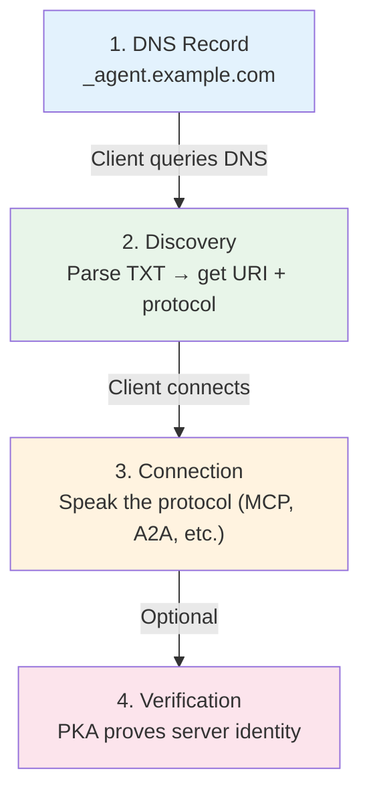
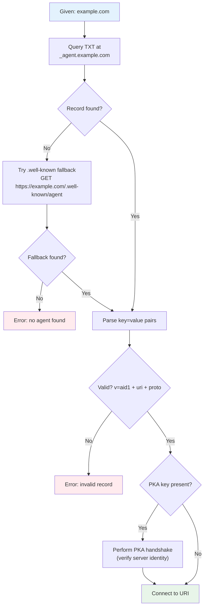

# Core Concepts

This page explains how AID works at a conceptual level. If you want the formal rules, see the [Specification](../specification.md). If you want to know _why_ it works this way, see the [Rationale](rationale.md).

## The DNS Address Book

Think of AID as a **phone book for AI agents**, built on DNS — the same system that already maps domain names to IP addresses.

Every domain owner can publish a single TXT record at `_agent.<domain>` that says: "My agent is here, it speaks this protocol, and here's how to verify it's really me."

```
_agent.example.com  TXT  "v=aid1;u=https://api.example.com/mcp;p=mcp;s=My Agent"
```

That's it. No registry to sign up for. No SDK to install on the provider side. Just a DNS record.

## How the Pieces Fit Together

AID has four stages. Each one is optional to understand, but they build on each other.



1. **DNS Record** — The provider publishes a TXT record with the agent's URI and protocol.
2. **Discovery** — The client queries DNS, parses the record, and extracts the connection details.
3. **Connection** — The client connects to the URI using the declared protocol (MCP, A2A, OpenAPI, etc.).
4. **Verification** — If a public key (`pka`) is present, the client performs a cryptographic handshake to prove the server is authentic.

## Anatomy of a TXT Record

Every AID record is a semicolon-delimited string of `key=value` pairs.

```
v=aid1;u=https://api.example.com/mcp;p=mcp;a=pat;s=My AI Agent;d=https://docs.example.com
```

Here's what each key means:

| Key       | Alias | Required    | Purpose                                       |
| --------- | ----- | ----------- | --------------------------------------------- |
| `version` | `v`   | Yes         | Must be `aid1`. Identifies the spec version.  |
| `uri`     | `u`   | Yes         | The agent's endpoint URL.                     |
| `proto`   | `p`   | Yes         | Which protocol the endpoint speaks.           |
| `auth`    | `a`   | Recommended | Hint for the authentication method.           |
| `desc`    | `s`   | Optional    | Human-readable description (max 60 bytes).    |
| `docs`    | `d`   | Optional    | Link to the agent's documentation.            |
| `dep`     | `e`   | Optional    | Deprecation timestamp (ISO 8601 UTC).         |
| `pka`     | `k`   | Optional    | Ed25519 public key for identity verification. |
| `kid`     | `i`   | With `pka`  | Key rotation ID (1–6 chars).                  |

**Aliases** (`v`, `u`, `p`, etc.) exist for byte efficiency in DNS TXT records, which have a 255-byte-per-string limit. Use whichever form you prefer — clients understand both.

## The Discovery Algorithm

When a client is given a domain, it follows this process:



**Key points:**

- DNS is always tried first. The `.well-known` fallback is only used if DNS fails.
- A record is invalid without all three required keys: `v=aid1`, `uri`, and `proto`.
- PKA verification happens before the client trusts the connection.

## Choosing a Protocol

AID supports 9 protocol tokens. Here's when to use each:

| If your agent...                             | Use `proto=` |
| -------------------------------------------- | ------------ |
| Exposes tools for LLMs (MCP servers)         | `mcp`        |
| Participates in multi-agent orchestration    | `a2a`        |
| Has a REST API with an OpenAPI spec          | `openapi`    |
| Uses gRPC for high-performance communication | `grpc`       |
| Exposes a GraphQL API                        | `graphql`    |
| Needs real-time bidirectional streaming      | `websocket`  |
| Runs locally on the user's machine           | `local`      |
| Is discoverable on a local network           | `zeroconf`   |
| Handles commercial transactions              | `ucp`        |

For full details on each protocol, see [Protocols & Auth](../Reference/protocols.md).

## When to Add PKA

PKA (Public Key Attestation) adds cryptographic proof that the server you're connecting to is the one the domain owner intended. It's optional but recommended for production.

**Add PKA when:**

- Your agent handles sensitive data or actions
- You're in a regulated industry
- You want to protect against DNS spoofing or MitM attacks
- Your users need enterprise-grade trust guarantees

**Skip PKA when:**

- You're in local development
- The agent is public and non-sensitive (e.g., a demo)
- You're just getting started and want to keep things simple (you can add it later)

For implementation details, see [Identity & PKA](../Reference/identity_pka.md).

## Next Steps

- [Quick Start](../quickstart/index.md) — Publish and discover your first agent in minutes
- [Specification](../specification.md) — The formal rules
- [Rationale](rationale.md) — Why AID works the way it does
- [FAQ](faq.md) — Common questions answered
