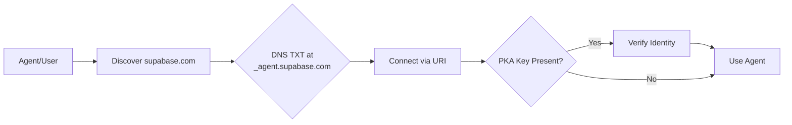

[View raw markdown](https://github.com/agentcommunity/agent-identity-discovery/raw/main/packages/docs/index.md)

# Agent Identity & Discovery (AID)

> ## The 0-th hop for agent discovery.

> Type a domain. Find the current agent endpoint.

AID is a small, DNS-first standard for the first contact with an agent or tool service.

It answers one question: **"Given a domain, where does the agent interaction begin?"**

One `_agent` TXT record maps a domain to an endpoint, protocol hint, and optional endpoint-proof key. From there, the selected protocol, auth, policy, and capability layers take over.

!!! tip "New to AID?"
Start with [Core Concepts](Understand/concepts.md) for a quick overview, then follow the [Quick Start](quickstart/index.md) to publish your first agent.

[Try it Now — Live Resolver & Generator](https://aid.agentcommunity.org/workbench)

---

## Why It Matters

AID gives clients a stable starting point without creating a central registry.

!!! user "For Users: It Just Works - no setup wizard, no MCP copy-pasting."

    You want to connect your Notion to a new AI assistant. You type `notion.so`. The connection happens automatically. Your experience is instant.

!!! agent "For Agents: Autonomous Discovery - a standard first hop for interoperability"

    As an autonomous agent, you're tasked with analyzing a dataset stored in a Supabase project. You don't need a hard-coded endpoint. You can discover the `supabase.com` agent endpoint, then continue into the protocol and auth layer.

---

## How It Works: The 30-Second Explainer

The entire mechanism is a single DNS lookup. It's simple, decentralized, and built on infrastructure that has powered the internet for decades.

1.  **Publish:** A provider (e.g., `supabase.com`) adds one `TXT` record to their DNS at a standard location: `_agent.supabase.com`.
2.  **Discover:** A client, given `supabase.com`, makes a single DNS query for the `TXT` record at that address.
3.  **Connect:** The record contains the agent's `uri`. The client uses it to connect directly.
4.  **Verify:** If a public key (`k`) is present, the client performs PKA endpoint proof before trusting the endpoint. (Optional)

[Try this flow now](https://aid.agentcommunity.org/workbench)

## Learn more

### Want the deep dive?

- [**Specification**](specification.md) – _The exact format, algorithms, and security rules._
- [**Core Concepts**](Understand/concepts.md) – _How DNS discovery, protocols, and identity fit together._
- [**Identity & PKA**](Reference/identity_pka.md) – _What endpoint proof adds and where its boundary is._
- [**PKA Endpoint Proof**](Reference/pka.md) – _The exact HTTP signature profile for implementers._
- [**Rationale**](Understand/rationale.md) – _The design philosophy behind AID._
- [**Security Best Practices**](Reference/security.md) – _DNSSEC, redirect handling, local execution, IDN safety, TTL & caching._
- [**Enterprise Rollout**](Reference/enterprise_rollout.md) – _Change windows, delegation patterns, and DNS team vs app team ownership._
- [**aid-doctor CLI**](Tooling/aid_doctor.md) – _Validate, secure, and generate AID records._

---

## SDKs and Tools

AID has official libraries and tools across multiple languages, with additional ports in progress.

- TypeScript/Node & Browser: `@agentcommunity/aid`
- TypeScript Core Library: `@agentcommunity/aid-engine` – Pure business logic for discovery, validation, and PKA
- CLI Tool: `@agentcommunity/aid-doctor` – Validate, secure, and generate AID records (wraps aid-engine)
- Python: `aid-discovery` (transfer to community planned)
- Go: `aid-go` (source-only until module repo/tags are published)
- Rust: `aid-rs` (source-only until crate publication is resolved)
- .NET: `aid-dotnet` (source-only until NuGet publication is ready)
- Java: `aid-java` (source-only until Maven publication is ready)
- Web Workbench: Interactive generator/resolver

See the full package overview in [SDKs and Packages](Reference/packages.md) and the cross-language [Discovery API](Reference/discovery_api.md).

---

## Use Cases

- Simple connections: Type a domain, connect automatically. No manual setup.
- Stronger trust (optional): Add identity proof to ensure you’re talking to the right service. See [Identity & PKA](Reference/identity_pka.md).
- Local and dev workflows: Safely run local agents with explicit consent; discover dev agents on your network.
- Multi-protocol ecosystems: Connect across MCP, A2A, OpenAPI, gRPC, GraphQL, or WebSocket.
- Smooth migrations: Deprecate old endpoints gracefully with clear timelines.
